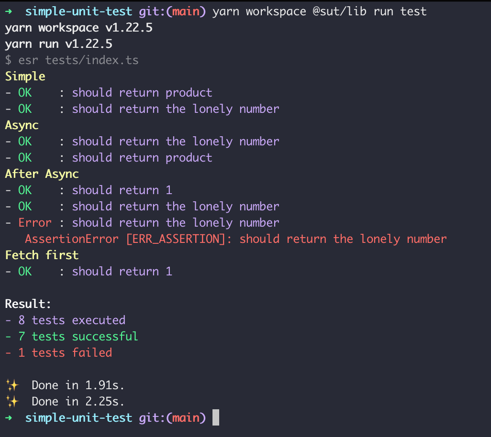

# Simple-unit-test (simut)

To make super simple unit test on typescript.

## Appendix

The idea was to make it as simple as possible to make some unit test in typescript or javascript. Was more thinking of using this for simple things like experiments where you need basic test to go faster or iterview tests, exercises like advent of code, etc

Tools like jest/tape are really complete and offer a lot but always require some setup (ts-node, babel, ...). I wanted something super easy to start with.

I usually use `assert` from node to do the tests but any testing library that throw on error should work.

To run the test i simple use `esbuild-runner` [repo](https://github.com/folke/esbuild-runner)

```bash
esr tests/index.ts
```

Right now i only have one file, i'm looking into making this work for multiple files.

It's mostly a experiment and me trying to kill time while i'm looking for a job.

**If you need production level testing, please use Jest, Mocha, Tape or your favorite battle tested test runner.**



## Installation

```bash
yarn add simut
```

#### Peer dependencies

```bash
yarn add -D esbuild esbuild-runner
```

## Usage/Examples

```typescript
import fetch from 'node-fetch'
import { strict as assert } from 'assert'

import { test, run, group } from '../src'
import { lonelyNumber } from '../src/example'

group('Simple')

test('should return product', async () => assert.equal(lonelyNumber(1, 2, 3), 6, 'should return the product'))
test('should return the lonely number', async () => assert.equal(lonelyNumber(1, 1, 3), 3, 'should return the lonely number'))

group('Async')

test('should return the lonely number', async () =>
	new Promise((r, re) => {
		setTimeout(() => {
			try {
				assert.equal(lonelyNumber(1, 1, 4), 4, 'should return the lonely number')
				r()
			} catch (e) {
				re(e)
			}
		}, 1000)
	}))
test('should return product', async () => assert.equal(lonelyNumber(1, 2, 3), 6, 'should return the product'))

group('After Async')

test('should return 1', async () => assert.equal(lonelyNumber(3, 3, 3), 1, 'should return 1'))
test('should return the lonely number', async () => assert.equal(lonelyNumber(3, 1, 3), 1, 'should return the lonely number'))
test('should return the lonely number', async () => assert.equal(lonelyNumber(3, 1, 3), 3, 'should return the lonely number'))

group('Fetch first')

test('should return 1', async () =>
	fetch('https://deckofcardsapi.com/api/deck/new/shuffle/?deck_count=1').then(() =>
		assert.equal(lonelyNumber(3, 3, 3), 1, 'should return 1')
	))

run()
```

## API Reference

#### test

```typescript
test('test name', async () => 'assertion returning a promise or throwing or error')
```

| Parameter | Type       | Description                                                           |
| :-------- | :--------- | :-------------------------------------------------------------------- |
| `title`   | `string`   | **Required**. Description of the test                                 |
| `fn`      | `function` | **Required**. function throwing of test error and returning a promise |

Create a new test

#### group

```typescript
group('Group title')
```

| Parameter | Type     | Description                     |
| :-------- | :------- | :------------------------------ |
| `title`   | `string` | **Required**. Name of you group |

Create a group

#### run

```typescript
run()
```

Run the tests and print the output in terminal

## License

[MIT](https://choosealicense.com/licenses/mit/)
